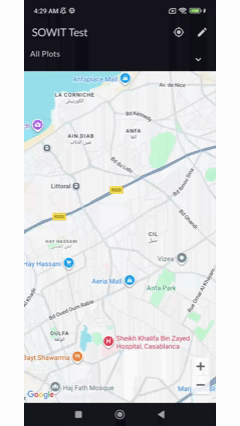
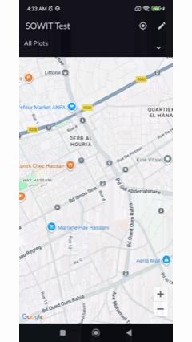

<h1>SOWIT Android Developer Test</h1>

A simple app that allows users to draw polygons on Google Maps and save them to local storage.

Check the release page to download a release apk. 

## Tech Stack and Android APIs used

* Kotlin
* Jetpack Compose
* Google Maps
* Room
* Coroutines
* Flows
* Hilt
* Location Services

## App Features

### Draw Polygons on Map
The user can draw on the map. Once the user enables drawing by clicking on the edit button, they can plot points on the map and draw a polygon.

### Store Polygons to local Storage
The user can save the polygon and other details, such as a custom name, city, and color, to local Storage.

### List Polygons
The app list all saved polygons. Once a polygon is clicked, the map camera will animate to show the polygon and adjust the zoom to show the entire polygon.

### Access Location 
For better user experience, the user can allow the app to access device's location. When location is enabled, the app will automatically center the map on the user's location.

### Response UI
The app UI is responsive. 

### Adjust Points dynamically
Points that are plotted while drawing a polygon, are dynamically adjusted as the camera zoom changes.

## CI/CD 
For seamless development. This repository has an automated CI/CD workflow using Github Actions. The workflow build a signing apk and create a release.

